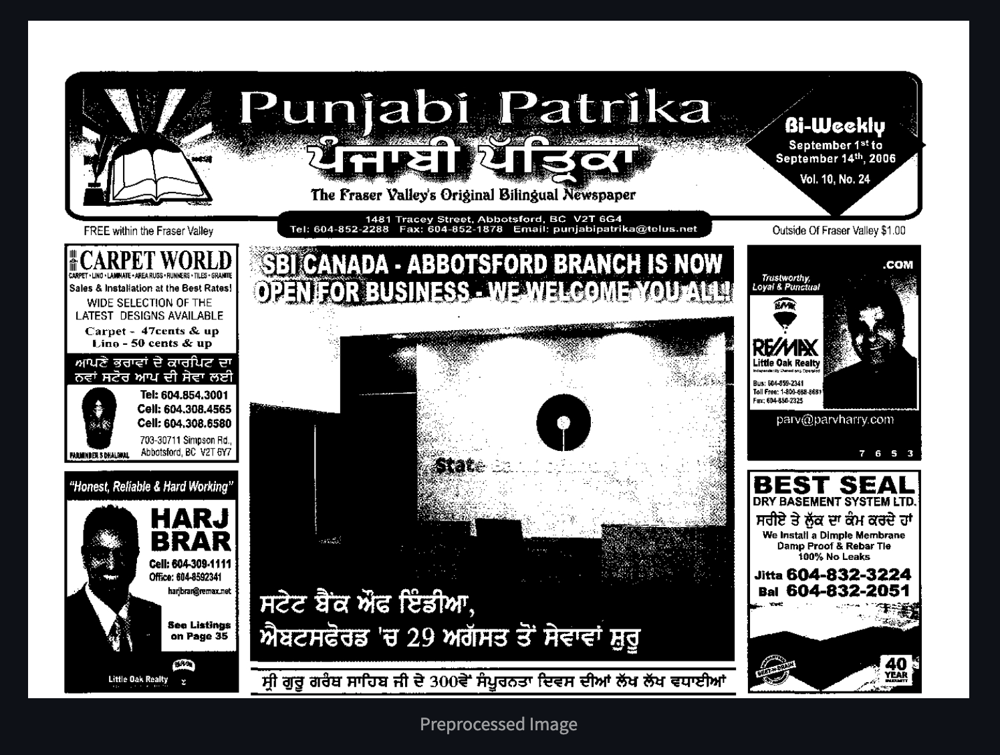

# Gurmukhi_OCR
OCR for Gurmukhi script.

**First Steps:**

Initially I created a streamlit app to create the demo version. This app allowed for images to be uploaded.

After the file was uploaded it went through preprocessing, which included Otsu's Threshold binarization. 

Underneath this, the option to download the extracted Gurmukhi text was also presented.

